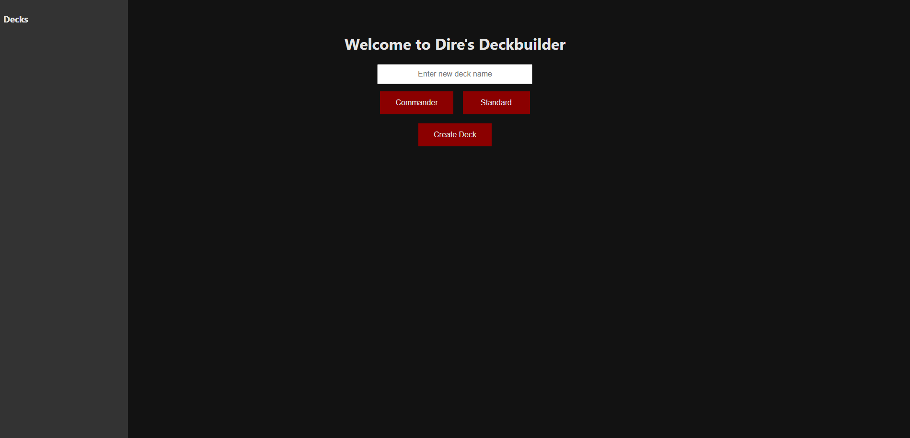
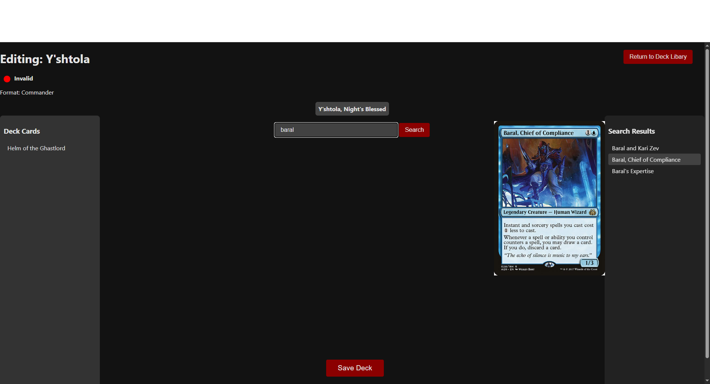

# MTG Deck Builder

This app is the culmination of my study on [Boot.dev](https://boot.dev). It supports building, exporting, and storage of Magic: The Gathering (MTG) decks

For my final project, I decided to merge two passions: **Magic: The Gathering** and **coding**. I wrote this to demonstrate proficiency in setting up backend servers and working with frontend data transfer.

## Front-end Feature Set

- Create and delete decks
- Export decks to Cockatrice (.cod) or MTGO (.txt) formats
- Robust deck editor with full rules enforcement

## Back-end Endpoints

| Method | Endpoint         | Description                                                                 |
|--------|------------------|-----------------------------------------------------------------------------|
| GET    | `/`              | Landing page; supports calls to various other endpoints                      |
| POST   | `/newdeck/`      | Creates a new deck within the server's filesystem or the database (TBD)      |
| GET    | `/listdecks/`    | Lists all decks in the filesystem (or database); called automatically on load|
| GET    | `/editor`        | Changes the page to the editor and initializes it                            |
| GET    | `/searchcards`   | Searches Scryfall for cards, with built-in filtering                         |
| GET    | `/deckinfo`      | Used by the server to pass information about the current deck                |
| POST   | `/savedeck`      | Saves the deck and any changes made to it in the filesystem                  |
| DELETE | `/deletedeck`    | Permanently removes the specified deck from the filesystem                   |
| GET    | `/exportdeck`    | Formats and starts download of the current deck                              |

## Tech Stack
I built this app using   
[Chi](https://github.com/go-chi/chi): For routing the server.     
[GO](https://go.dev/): Language the server is written in.    
[Go-scryfall](https://github.com/BlueMonday/go-scryfall?tab=readme-ov-file): API client for accessing Scryfall.        
JavaScript: Front-end logic and interactivity  

## Future Features

- Add EDHREC recommendations
- Add more filtering options

## Setup
1. Clone the repo
2. Build and run the app with `go build` and `./MTG-deck-builder-image`
3. The app will open on http://localhost:8080/ by default, port can be set in the .env file.   
